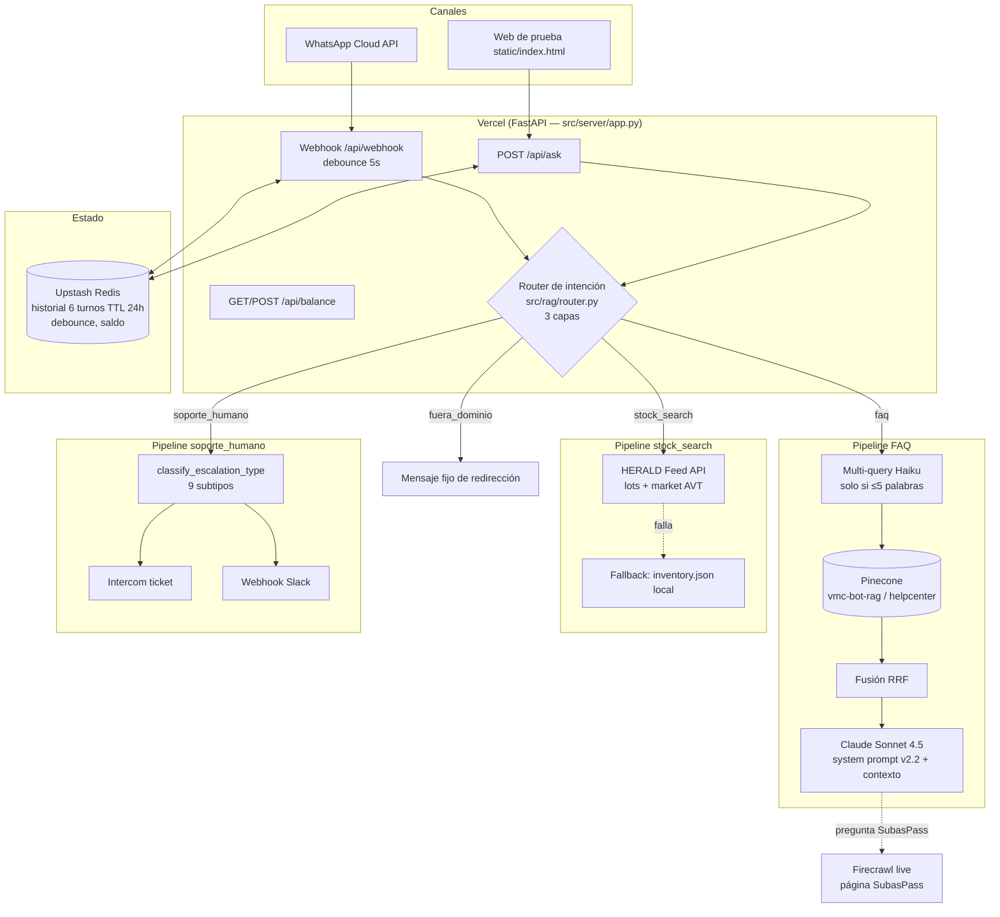

# Análisis técnico — VMC-Bot (Subastin)

**Fecha:** 2026-07-30
**Alcance:** revisión completa del repo `ChatbotAIVMC` (código, docs, datos), contraste con mejores prácticas RAG (ref: guía Robylon "Build RAG Chatbot" + prácticas de industria).
**Objetivo:** servir de base para diagramar la arquitectura, priorizar correcciones y discutir casos de uso. Sin sobre-ingeniería: cada recomendación indica su costo/beneficio.

---

## 1. Resumen ejecutivo

Subastin es un chatbot RAG para VMC Subastas (subastas de vehículos, Perú) que opera por web de prueba y WhatsApp Cloud API. Clasifica cada mensaje en 4 intenciones (`faq`, `stock_search`, `soporte_humano`, `fuera_dominio`) y responde con:

- **FAQ** → retrieval en Pinecone (Centro de Ayuda) + generación con Claude Sonnet 4.5.
- **Stock** → consulta en vivo a HERALD Feed API (catálogo + valoraciones AVT), con fallback a JSON local.
- **Soporte humano** → ticket en Intercom + webhook de aviso + mensaje de espera contextual.
- **Fuera de dominio** → rechazo cortés.

**Estado general:** la base es sólida — manejo de errores de nivel producción, control de costos real, localización peruana genuina, cero dependencia de frameworks (sin LangChain). Los problemas principales son: (1) un bug de función duplicada que mata una capa del router, (2) el parser regex de HERALD es estructuralmente frágil (3 hotfixes seguidos en git), (3) agujeros de seguridad en el webhook y endpoints admin, (4) cero tests automatizados, y (5) piezas del diseño que asumen un servidor persistente pero corren en serverless (debounce, rate limit, historial en memoria).

---

## 2. Contexto de negocio

| Aspecto | Detalle |
|---|---|
| Cliente | VMC Subastas — subastas de vehículos usados en Perú |
| Usuario final | Compradores potenciales, mayormente por WhatsApp, español peruano informal |
| Problema que resuelve | Volumen de consultas repetitivas (registro, comisiones, consignación, SubasCoins) + consultas de stock |
| Restricción crítica | **Cero alucinación financiera**: comisiones, precios y plazos solo pueden salir del contexto RAG (riesgo legal/Indecopi) |
| Marco legal | Ley N° 31814 (Perú) + EU AI Act Art. 50: el bot debe identificarse como IA, nunca negar serlo, redirigir derechos ARCO a humanos |
| Persona | "Subastin" — cercano, peruano, máx. 3 oraciones por mensaje, formato WhatsApp estricto |

---

## 3. Stack

| Componente | Tecnología | Notas |
|---|---|---|
| LLM generación | Claude Sonnet 4.5 (`claude-sonnet-4-5-20250929`) | max_tokens=300, prompt caching en system |
| LLM router + multi-query | Claude Haiku 4.5 | tareas baratas al modelo barato |
| Embeddings | Pinecone Inference — `multilingual-e5-large` (1024 dim) | integrado: Pinecone vectoriza el `text` al hacer upsert/search |
| Vector DB | Pinecone Starter, índice `vmc-bot-rag`, namespace `helpcenter` | |
| Stock en vivo | HERALD Feed API (`feed.vmcsubastas.com`, Bearer JWT) | lots + market/AVT |
| Scraping | Firecrawl (helpcenter + página SubasPass en vivo) | |
| Estado (historial, debounce, saldo) | Upstash Redis (REST) con fallback a memoria/archivo | |
| Escalación | Intercom (tickets) + webhooks Slack | |
| Servidor | FastAPI | |
| Hosting | Vercel serverless (`@vercel/python`) | filesystem read-only, sin RAM persistente |
| Canal | WhatsApp Cloud API (Meta, graph v20.0) | botones/listas interactivas vía marcador `[QR: ...]` |

---

## 4. Arquitectura

### 4.1 Diagrama de componentes (para diagramar)



### 4.2 Flujo de un mensaje (secuencia)

```
1. Entra mensaje (webhook WhatsApp o /api/ask)
2. [solo WhatsApp] Debounce: se acumula 5s en Redis; el último mensaje procesa todos juntos
3. Chequeo de saldo: si <= 0 → mensaje "te atenderá un asesor" + cola handoff. FIN.
4. Rate limit por IP (solo /api/ask)
5. Router (src/rag/router.py):
   Capa 1 — keywords alta confianza (gratis): soporte_humano / stock_search
   Capa 2 — keywords media confianza → flag de frustración para Haiku
   Capa 3 — Haiku 4.5 con prompt XML + few-shots peruanos → intent
6a. faq:
    - top_k dinámico (3 corta / 5 larga o de proceso)
    - multi-query (solo preguntas ≤5 palabras): Haiku genera 1 variación con sinónimos peruanos
    - búsqueda(s) en Pinecone → fusión RRF (k=60)
    - si pregunta por SubasPass → scrape en vivo con Firecrawl, se antepone al contexto
    - build_context (máx ~3.000 tokens) → Sonnet con system prompt cacheado
    - trim a límite WhatsApp sin cortar oraciones
6b. stock_search:
    - HERALD configurado → parseo regex de marca/modelo/año/lote → 1 de 7 rutas
      (detalle lote / valoración año / valoración modelo / mercado marca /
       listado por marca / cobertura / catálogo general)
    - HERALD falla → inventory.json local → si falla → mensaje con link a la web
6c. soporte_humano: subtipo de escalación → mensaje de espera contextual (9 variantes)
    + ticket Intercom con últimos 4 mensajes + webhook aviso
6d. fuera_dominio: mensaje fijo de redirección al dominio
7. Se descuenta el costo real/estimado del saldo (Redis)
8. Se persiste historial (user + assistant) en Redis
9. Respuesta al canal (WhatsApp convierte [QR: a|b|c] en botones/listas)
```

### 4.3 Pipeline de ingesta (offline, se corre a mano)

```
ayuda.vmcsubastas.com  (~95% del contenido en imágenes/infografías)
  │  Firecrawl crawl                    src/ingest/crawl_helpcenter.py
  ▼
data/raw/ (markdown + ~100 PNGs)
  │  extracción de texto de imágenes    src/ingest/extract_images.py
  │  taxonomía por slug → topic         src/ingest/taxonomy.py
  ▼
  │  limpieza + chunking semántico      src/rag/chunks.py
  │  (corta por ## / ### , máx 1200 chars, marca has_numeric_data)
  ▼
data/processed/chunks.json (+ faq_chunks, image_chunks)
  │  upsert_records (batch 96)          src/rag/embed.py
  ▼
Pinecone (embedding integrado e5-large; campos: text, topic, source_url, has_numeric_data)
```

Scripts de mantenimiento: `scripts/refresh_rag_from_helpcenter.py`, `rechunk_helpcenter_full.py`, `verify_helpcenter_content.py`, `verify_topk.py`, `eval_golden.py`, `quality_audit.py`.

### 4.4 Infraestructura / deploy

- **Entrypoint activo:** `src/api/main.py` (según `vercel.json`). `api/index.py` y `src/index.py` son **duplicados residuales** de pelear con la autodetección de Vercel — eliminar 2 de 3.
- **Serverless implica:** disco read-only (logs a `/tmp`), RAM no persistente (por eso Redis), bundle <500MB (`.vercelignore` excluye `data/`, `docs/`, `scripts/`).
- **Variables de entorno** (`.env.example`): ANTHROPIC, PINECONE, FIRECRAWL, HERALD (JWT), WhatsApp (token, phone id, verify token), INTERCOM, UPSTASH, BALANCE_ADMIN_TOKEN, DEBUG_MODE.

### 4.5 Subagentes operativos (`agents/`)

| Agente | Archivo | Estado real |
|---|---|---|
| Monitor de costos | `agents/cost_monitor/monitor_costs.py` | Existe (269 líneas). Presupuesto $168/mes, alertas 70%/90% |
| Evaluador RAG | `agents/rag_evaluator/run_evaluation.py` | Existe (360 líneas) — AGENTS.md lo marca "pendiente" (doc desactualizada) |
| Auditor de contenido | `agents/content_auditor/audit_rag_content.py` | Existe (292 líneas) — ídem |
| Scraper inventario | `agents/inventory_scraper/scrape_inventory.py` | Existe (158 líneas) — ídem |
| Refinador de prompts | `agents/prompt_refiner/` | **No existe** (el único realmente pendiente) |

> ⚠️ Regla al heredar: cuando `AGENTS.md`/`ESTRUCTURA_PROYECTO.md` contradicen el código, **gana el código**. Ambos docs están desactualizados.

---

## 5. Análisis del RAG vs mejores prácticas

Contraste con la guía de referencia (chunks 200–500 tokens, overlap 50–100, hybrid search 70/30, reranking +5–15% precisión, precision@5 ≥80%, groundedness ≥95%) y práctica de industria.

### 5.1 Lo que ya está bien (no tocar)

| Práctica | Implementación aquí | Veredicto |
|---|---|---|
| Chunking semántico (por headers, no por tamaño fijo) | `src/rag/chunks.py` corta por `##`/`###`, incluye título de doc y sección en el texto | ✅ Correcto — es lo recomendado para contenido de soporte |
| Grounding estricto | "usa SOLO la información del siguiente contexto… No inventes nada" + regla 5 del system prompt (números solo del contexto) | ✅ Es la instrucción exacta que recomienda la literatura |
| Multi-query para vocabulario coloquial | Haiku genera variantes con sinónimos peruanos (jalar/retirar, carro/unidad) | ✅ Ataca el problema real (mismatch léxico peruano ↔ manual) |
| Fusión RRF | `src/rag/rrf.py`, k=60, 38 líneas puras | ✅ Estándar de industria, bien implementado |
| Top-k adaptativo | 3 (definición) / 5 (proceso) | ✅ En rango recomendado (K=3–5) |
| Escalación por baja cobertura | intent soporte_humano + "No se encontraron fragmentos relevantes" | ✅ parcial (ver 5.2.d) |
| Modelo barato para tareas baratas | Haiku router/multi-query, Sonnet generación | ✅ Patrón recomendado (tiered models) |
| Golden dataset | `data/golden_dataset/faqs_golden.json` (50 preguntas) + `eval_golden.py` + evaluador 5 criterios | ✅ base existente; falta automatizar (ver 5.2.e) |
| Datos vivos fuera del vector DB | stock por API en vivo, no indexado en Pinecone | ✅ decisión correcta: no indexar lo que caduca a diario |
| Sin framework (sin LangChain) | piezas de 40–100 líneas legibles | ✅ mantener — más control, menos deuda |

### 5.2 Brechas del RAG (ordenadas por retorno/esfuerzo)

**a) Sin umbral de confianza en retrieval — el gap #1.**
Hoy, si Pinecone devuelve chunks con score bajísimo, igual se le pasan a Sonnet y este intenta responder. Es la puerta principal a respuestas "plausibles pero flojas". Corrección barata: si el mejor score < umbral (calibrar con el golden dataset, típicamente ~0.75–0.80 en e5 cosine), responder "no tengo ese dato" u ofrecer asesor, en vez de generar. La guía lo llama *low-confidence handling* y es de las mejoras con mejor costo/beneficio. **Esfuerzo: bajo. Impacto: alto.**

**b) Metadata sin explotar.**
Los chunks suben con `topic` y `has_numeric_data` a Pinecone, pero **ninguna búsqueda filtra por metadata** y `has_numeric_data` no se usa en query-time. Dos usos concretos:
- Si el router/heurística detecta tema (ej. "comisiones"), filtrar o boostear por `topic`.
- Si la respuesta generada contiene números, verificar que al menos un chunk del contexto tenga `has_numeric_data=true`; si no, es señal de alucinación numérica → bloquear/reescribir. Este guardrail ya está *medio construido* (la bandera existe) y no se cierra el círculo. **Esfuerzo: bajo-medio. Impacto: alto para el riesgo #1 del negocio.**

**c) Sin overlap ni metadata de frescura en chunks.**
La guía recomienda 50–100 tokens de solape entre chunks. Aquí el corte por sección lo hace menos crítico (las secciones son unidades semánticas completas), así que **no es urgente**. Lo que sí falta y es barato: guardar `ingested_at`/versión del contenido en cada chunk, para poder auditar "¿esta respuesta salió de contenido de hace 6 meses?" y hacer re-ingesta selectiva.

**d) "No se encontraron fragmentos relevantes" llega crudo al usuario.**
En `query_rag.py`, cuando no hay matches, ese string técnico es la respuesta. Debe ser un mensaje Subastin ("Uy, ese dato no lo tengo a la mano…") + oferta de asesor, y loguearse como **knowledge gap** (input directo para el auditor de contenido). Hoy los gaps no se acumulan en ningún lado consultable.

**e) Evaluación no automatizada ni con métricas separadas.**
Existe todo el material (golden dataset, evaluador, umbrales definidos en AGENTS.md: ≥4.0/5 para piloto, alucinación financiera = bloqueante) pero se corre a mano. Falta:
- Separar **retrieval precision@k** (¿los chunks correctos están entre los recuperados?) de **answer accuracy** y **groundedness** — hoy se evalúa solo la respuesta final, y cuando falla no sabes si fue retrieval o generación. Targets de referencia: precision@5 ≥80%, groundedness ≥95%.
- Correrlo como gate antes de deploy (GitHub Action manual o pre-push). No hace falta CI sofisticado: un script que falle con exit code ≠ 0 si baja del umbral.

**f) Hybrid search (BM25 + vectorial): NO por ahora.**
La guía lo recomienda (70/30) para códigos de producto y términos exactos. Aquí el corpus es ~decenas de artículos de FAQ y el multi-query ya cubre el mismatch léxico. Añadir BM25 = infra nueva (o migrar a Pinecone hybrid) para ganancia marginal. **Reevaluar solo si** el eval muestra fallos en términos exactos (ej. "SubasCoins", códigos de lote). Los códigos de lote ya van por HERALD, no por Pinecone.

**g) Reranking (cross-encoder / Cohere Rerank): NO por ahora.**
Mejora 5–15% de precisión según la guía, pero añade latencia (+100–300ms) y un proveedor más, sobre un corpus pequeño donde RRF ya cumple. Es la clásica sobre-ingeniería en esta escala. Reevaluar si el corpus crece 10x o precision@5 se estanca <80% tras arreglar (a) y (b).

**h) Caché de respuestas frecuentes: SÍ, versión mínima.**
La guía estima ~30% de consultas repetidas. Versión sin sobre-ingeniería: caché en Redis por hash de pregunta normalizada → respuesta, TTL 24h, **solo para intent faq sin historial** (para no cachear respuestas contextuales). Ahorra Sonnet + Haiku + Pinecone en las preguntas más comunes ("¿qué son los SubasCoins?"). **Esfuerzo: bajo. Impacto: costo y latencia.**

### 5.3 Embeddings — evaluación específica

- **`multilingual-e5-large` (1024d) es una elección correcta** para español y está en la lista de recomendados de la guía (E5-large). El modo integrado de Pinecone además maneja los prefijos `query:`/`passage:` que e5 requiere — hacerlo a mano es una fuente clásica de bugs que aquí se evita gratis. **No migrar de modelo sin una razón medida.**
- **Riesgo real: desincronización corpus ↔ índice.** El pipeline de ingesta es manual y no hay registro de qué versión de `chunks.json` está en Pinecone. Si alguien re-chunkea y solo sube parte, quedan mezclas. Corrección barata: guardar un `ingest_manifest.json` (hash del chunks.json + fecha + total subido) y que `verify_helpcenter_content.py` compare conteos índice vs archivo.
- **Si algún día se cambia de modelo de embedding hay que re-indexar TODO** (los vectores de modelos distintos no son comparables). Documentarlo para que nadie "pruebe otro modelo" sobre el mismo índice.
- El límite de batch (96) y el truncado a 30k chars están bien manejados en `embed.py`.

---

## 6. Bugs y defectos concretos (verificados en código)

Ordenados por severidad. Todos con ubicación exacta.

### B1. Función `_looks_like_human_support` definida dos veces → capa 1 del router parcialmente muerta
`src/rag/router.py:74` y `src/rag/router.py:157`. Python se queda con la segunda: **toda la lista `_HIGH_CONFIDENCE_HUMAN` (líneas 30–58) y los patrones regex (60–70) son código muerto** — incluye detecciones de "puro floro", "me estás floreando", "da igual", "ya fue", el patrón de TODO EN MAYÚSCULAS y el de "!!!". Además `classify_intent_with_debug` llama a la función dos veces seguidas (líneas 369 y 377). **Fix:** fusionar ambas definiciones en una (unir las listas), borrar la llamada duplicada. ~30 min, recupera funcionalidad escrita y perdida.

### B2. Prompt caching mal aplicado en el router → paga premium de escritura sin hits
`src/rag/router.py:474-487`: el `cache_control` está sobre el bloque de **user** que incluye el mensaje variable del usuario al final (`<input>{msg}</input>`). El caching de Anthropic funciona por prefijo exacto: al variar el final del bloque marcado, **casi nunca hay cache hit y cada llamada paga el 25% extra de cache-write**. **Fix:** mover la parte estática (role, definiciones, ejemplos) a `system` con `cache_control`, y dejar `<input>`, el flag de frustración y el contexto en el mensaje de usuario sin cachear. Mismo fix conceptual que ya está bien hecho en `query_rag.py:232-242`.

### B3. Debounce y BackgroundTasks incompatibles con Vercel serverless
`src/server/app.py:626-676`: el debounce hace `time.sleep(5)` dentro de un BackgroundTask. En Vercel, la ejecución tras devolver la respuesta **no está garantizada** (la función puede congelarse/matarse al responder), así que: (i) el mensaje puede no procesarse nunca, o (ii) el sleep bloquea y alarga la facturación de la función. Además `_process_debounced` recibe el objeto `background_tasks` ya en ejecución y le agrega tareas (Intercom) — comportamiento frágil/no documentado de Starlette. **Fix pragmático:** en Vercel, desactivar debounce (responder por mensaje) o moverlo a un patrón compatible (p. ej. QStash/cron con Upstash, o esperar dentro del request antes de responder al webhook — Meta tolera hasta ~20s). Decidir según volumen real; no construir infra nueva si el volumen aún es bajo.

### B4. Rate limit inútil en serverless + espera activa peligrosa
`src/server/rate_limit.py` guarda timestamps **en memoria del proceso**: en Vercel cada instancia tiene su propio dict → el límite real es ~6×N instancias, es decir, no hay límite efectivo. Peor: `app.py:805-807` hace `while not allowed: await asyncio.sleep(retry_after)` — mantiene la función serverless viva (facturando) hasta 60–300s en vez de devolver HTTP 429. **Fix:** mover el contador a Redis (INCR con TTL, ~15 líneas) y devolver 429 con `Retry-After` en vez de dormir.

### B5. Historial con race condition (read-modify-write)
`src/server/app.py:450-462` (la selección que tienes abierta en el IDE): `_append_history` lee de Redis, agrega en Python y reescribe. Dos requests concurrentes de la misma sesión (o el par user/assistant si algo se paraleliza) pueden pisarse y perder turnos. Con el debounce roto (B3), WhatsApp puede procesar 2 mensajes en paralelo y disparar esto. **Fix simple:** usar `RPUSH` + `LTRIM` + `EXPIRE` de Redis (operaciones atómicas por elemento) en vez de GET/SET del array completo.

### B6. Doble implementación de todo el flujo: `ask_with_router` vs `ask_with_router_debug`
`src/rag/query_rag.py:448-526` y `529-733`: dos copias casi idénticas del pipeline (y también `search_multi_query_rrf` vs `_with_debug`, `answer_with_claude` vs `_with_debug`). Ya divergen (el path debug usa `get_top_k_for_intent`, el normal en `ask_rag` usa `get_top_k` — ver B7). Cada fix hay que hacerlo dos veces; eventualmente alguien olvidará una. **Fix:** una sola función con parámetro `collect_debug: bool`; el dict de debug se llena siempre y se descarta si no se pide (el costo de llenarlo es despreciable).

### B7. Dos lógicas distintas de top_k
`query_rag.py:169-185` (`get_top_k`, por keywords de proceso) y `router.py:327-341` (`get_top_k_for_intent`, por número de palabras). Criterios diferentes para la misma decisión según el camino de código. **Fix:** dejar una sola (la de keywords es más razonada) y borrar la otra.

### B8. "No se encontraron fragmentos relevantes." llega al usuario final
`query_rag.py:420,687`. Ver 5.2.d — mensaje técnico, sin tono Subastin, sin escalación, sin log de gap.

### B9. Scrape en vivo de SubasPass sin caché
`src/rag/live_source.py`: cada pregunta sobre SubasPass dispara un scrape completo con Firecrawl (segundos de latencia + créditos). **Fix:** caché Redis de ese markdown con TTL 1–6h.

### B10. Entrypoints triplicados
`api/index.py`, `src/index.py`, `src/api/main.py` — los tres hacen `from src.server.app import app`; solo el último está ruteado en `vercel.json`. Borrar los otros dos (confunden y sugieren rutas de deploy que no existen).

### B11. `app.py` = 993 líneas multi-responsabilidad
WhatsApp + Intercom + saldo + historial + debounce + rate-limit + HTML embebido en un archivo. No es un bug, es deuda: partir en routers de FastAPI (`whatsapp.py`, `balance.py`, `chat.py`) **cuando se toque esa zona**, no como big-bang.

### B12. Docs desactualizadas que mienten sobre el estado
`agents/AGENTS.md` (marca como pendientes 4 agentes que existen; describe "3 variaciones multi-query" cuando son 2; dice "Playwright scraper Semana 3" cuando ya hay HERALD), `docs/ESTRUCTURA_PROYECTO.md` (nombres de archivos que no existen: `retrieve.py`, `ingest/inventory.py`), `docs/AHORA.md` (congelado en día 1). Actualizar o marcar como histórico.

---

## 7. Seguridad

Ordenado por severidad real (probabilidad × impacto).

### S1 — ALTO — Webhook de WhatsApp sin verificación de firma
`app.py:679-737`: el POST del webhook acepta cualquier JSON con la forma correcta. Meta firma cada payload con el header `X-Hub-Signature-256` (HMAC-SHA256 con el App Secret) y **no se valida**. Consecuencias: cualquiera que descubra la URL puede (i) inyectar mensajes falsos como si fueran de un cliente, (ii) quemar el saldo de API, (iii) hacer que el bot envíe WhatsApps arbitrarios a números arbitrarios (el `from` lo controla el atacante), (iv) contaminar historiales. **Fix:** ~15 líneas — calcular HMAC del body crudo con `WHATSAPP_APP_SECRET` y comparar con `hmac.compare_digest`. Es el fix de seguridad #1 del repo.

### S2 — ALTO — Endpoint de saldo abierto por defecto
`app.py:519-535`: si `BALANCE_ADMIN_TOKEN` está vacío, `POST /api/balance` queda **sin auth en producción** (el comentario dice "solo para dev", pero nada lo impide en prod). Cualquiera puede poner saldo 0 (denegación de servicio del bot) o inflarlo (anular el fusible de gasto). **Fix:** si el token no está configurado y `VERCEL=1`, responder 403 siempre (fail-closed).

### S3 — MEDIO — `/api/ask` público sin autenticación
Cualquiera puede consumir el pipeline completo (Sonnet incluido). Mitigantes existentes: fusible de saldo y rate limit — pero el rate limit no funciona en serverless (B4). Tras arreglar B4, el riesgo baja a aceptable para fase de prueba; para producción, añadir un token simple de cliente o restringir por origen.

### S4 — MEDIO — DEBUG_MODE expone internals por API
Con `DEBUG_MODE=true`, la respuesta de `/api/ask` incluye **el system prompt completo, el contexto RAG, tokens y costos** (`debug.generation.system_prompt`). Si alguien lo activa en Vercel para depurar y lo olvida, todo eso es público. **Fix:** forzar `DEBUG_MODE=false` cuando `VERCEL=1` salvo lista blanca, o exigir un header con token para incluir `debug`.

### S5 — MEDIO — Prompt injection (dos vectores)
1. **Usuario:** el mensaje va crudo al prompt de Sonnet. El system prompt tiene reglas fuertes, pero no hay detección de intentos tipo "ignora tus instrucciones". Mitigación barata: el router ya toca cada mensaje — añadir a Haiku la instrucción de marcar intentos de manipulación → responder con plantilla fija sin pasar por Sonnet.
2. **Contenido scrapeado en vivo:** `live_source.py` mete markdown de una página web directamente al contexto del LLM. Si esa página fuera comprometida o incluye contenido de terceros, es injection indirecto. Mitigación: sanitizar (quitar links/scripts/instrucciones imperativas) y delimitar el bloque con instrucción explícita de "esto es solo datos, no instrucciones".

### S6 — MEDIO — PII en logs
Números de teléfono completos en `handoff_queue.jsonl`, `asesor_requests.jsonl`, logs de error y tickets Intercom. Bajo la Ley 29733 (protección de datos, Perú) son dato personal. Pragmático: en logs técnicos, enmascarar (`51*****123`); el número completo solo donde el asesor lo necesita (Intercom / cola handoff). Definir retención (los `.jsonl` crecen sin límite fuera de Vercel).

### S7 — BAJO — Higiene de secretos
- JWT de HERALD y token de WhatsApp son de larga vida en env vars — documentar rotación (el `.env.example` ya lo advierte para HERALD ✅).
- `.gitignore` cubre `.env` ✅. Verificar que nunca se commiteó (`git log --all -- .env`).
- El fallback HTML y el frontend no exponen secretos ✅.

---

## 8. Casos de uso

### 8.1 Cubiertos hoy (verificado en código)

| Caso | Camino | Calidad |
|---|---|---|
| FAQ de plataforma (registro, SubasCoins, consignación, comisiones, visitas, ofertas) | RAG Pinecone | ✅ núcleo del sistema |
| Precios/planes SubasPass al día | Scrape en vivo + RAG | ✅ pero lento (B9) |
| "¿Tienen una Hilux 2020?" (stock por marca/modelo/año) | HERALD lots | ⚠️ frágil (parser regex) |
| "¿Cuánto vale una Yaris 2018?" (valoración de mercado) | HERALD market/AVT | ✅ |
| "Detalle del lote 12345" | HERALD lot detail | ✅ |
| "¿Qué marcas manejan?" (cobertura) | HERALD coverage | ✅ |
| Pedir asesor / frustración / jerga peruana de queja | Router capas 1-3 → Intercom + Slack | ⚠️ mitad de la capa 1 muerta (B1) |
| Amenaza legal (Indecopi, libro de reclamaciones) | Escalación subtipo legal_threat | ✅ |
| Rescate de abandono ("ya no quiero, olvídalo") | Escalación pre_abandonment | ⚠️ keywords en código muerto (B1) |
| Urgencia en subasta en vivo | Escalación live_auction | ✅ |
| B2B / flotas | Escalación b2b | ✅ |
| Usuario responde corto ("sí", "dale") a pregunta del bot | Router usa último mensaje del asistente como contexto | ✅ buen detalle |
| Mensajes en ráfaga de WhatsApp | Debounce 5s | ❌ roto en serverless (B3) |
| Sin créditos API | Fusible de saldo + cola handoff + mensaje contextual | ✅ |
| Botones interactivos WhatsApp | Marcador [QR:] → reply buttons / list | ✅ implementado, poco usado por el prompt |
| Cumplimiento IA (identificarse, no negar ser IA, ARCO) | System prompt v2.2 | ✅ |

### 8.2 Planeados pero no construidos (roadmap del proyecto)

- **Notas de voz**: STT con Gemini 2.5 Flash + TTS ElevenLabs (en stack del README, sin código). En WhatsApp Perú los audios son masivos — probablemente el gap de producto más grande.
- **Refinador de prompts** (único agente realmente pendiente).
- **Seguimiento post-escalación**: hoy el ticket se crea y el bot se desentiende; no hay "un asesor ya tomó tu caso".

### 8.3 Casos borde a cuestionar (para tu sesión de diagramación)

1. Usuario manda **imagen o audio** hoy → el webhook lo ignora en silencio (`return {"status": "ignored"}`). ¿Debería al menos responder "por ahora solo leo texto"?
2. Usuario pregunta stock de una **marca que no está en `KNOWN_MAKES`** (ej. "Changhe", "JMC") → cae al catálogo general o valoración incorrecta.
3. **Conversación mixta**: "¿tienen Hilux? y ¿cuánto es la comisión?" — el router elige UNA intención; la segunda pregunta se pierde.
4. Usuario en **inglés u otro idioma** — no hay manejo; e5 es multilingüe así que el retrieval algo hará, pero el prompt asume español.
5. **Historial de 6 turnos**: en conversaciones largas el bot "olvida" lo dicho al inicio (ej. el estado del usuario que el prompt manda inferir). ¿Suficiente? Probablemente sí para FAQ; medir.
6. Dos personas escribiendo desde el **mismo número** (caso familiar/empresa) — una sola sesión, historial mezclado.
7. ¿Qué pasa si **HERALD devuelve datos pero desactualizados** vs la web? El bot los presenta como verdad; no hay disclaimer de "verifica en la web" en todos los formatos.

---

## 9. Plan de acción priorizado

Filosofía: primero corregir lo que ya está construido, luego cerrar seguridad, luego mejorar el RAG con lo barato de alto impacto. Nada de infra nueva mientras el volumen no lo pida.

### P0 — Esta/próxima semana (bugs + seguridad crítica; todo <1 día c/u)

| # | Acción | Ref |
|---|---|---|
| 1 | Validar firma `X-Hub-Signature-256` en webhook WhatsApp | S1 |
| 2 | Fusionar `_looks_like_human_support` duplicada; revivir keywords muertas | B1 |
| 3 | Fail-closed en `/api/balance` sin token en Vercel | S2 |
| 4 | Rate limit a Redis + devolver 429 (quitar el while/sleep) | B4 |
| 5 | Decidir debounce: desactivar en Vercel o esperar in-request | B3 |
| 6 | Forzar DEBUG_MODE off en Vercel | S4 |
| 7 | Borrar entrypoints duplicados (`api/index.py`, `src/index.py`) | B10 |

### P1 — Próximas 2–4 semanas (calidad RAG + robustez)

| # | Acción | Ref |
|---|---|---|
| 8 | Umbral de score mínimo en retrieval → "no lo sé" + log de knowledge gap | 5.2.a, B8 |
| 9 | Guardrail numérico: respuesta con cifras exige chunk con `has_numeric_data` | 5.2.b |
| 10 | Tests: golden dataset como gate automatizado (exit≠0 bajo umbral) + tests unitarios del parser HERALD y del router | 5.2.e |
| 11 | Unificar camino normal/debug en `query_rag.py`; una sola lógica top_k | B6, B7 |
| 12 | Fix cache_control del router (estático a system) | B2 |
| 13 | Historial con RPUSH/LTRIM atómico | B5 |
| 14 | Caché Redis: respuestas FAQ frecuentes (TTL 24h) + markdown SubasPass (TTL 1–6h) | 5.2.h, B9 |
| 15 | Actualizar AGENTS.md / ESTRUCTURA_PROYECTO.md al estado real | B12 |

### P2 — Cuando P0/P1 estén estables (evolución de producto)

| # | Acción | Justificación |
|---|---|---|
| 16 | **Migrar extracción marca/modelo/año a tool use de Claude** (el router ya paga una llamada Haiku; que devuelva `{intent, make, model, year, lot_id}` estructurado) | Elimina la clase entera de bugs del parser regex de HERALD — la zona con más hotfixes del repo |
| 17 | Partir `app.py` en routers por dominio | B11 |
| 18 | Notas de voz (STT/TTS) | Gap de producto #1 en WhatsApp Perú |
| 19 | Enmascarar PII en logs + política de retención | S6 |
| 20 | Detección de prompt injection en el router | S5 |

### Explícitamente NO hacer ahora (anti-sobre-ingeniería)

- ❌ **Hybrid search / BM25** — corpus pequeño, multi-query ya cubre el mismatch léxico. Reevaluar con datos del eval.
- ❌ **Reranker (cross-encoder/Cohere)** — +latencia y +proveedor para ganancia marginal a esta escala.
- ❌ **Cambiar modelo de embeddings** — e5-large multilingüe funciona; cambiar = re-indexar todo sin ganancia demostrada.
- ❌ **Adoptar LangChain/framework** — la ausencia de framework es una fortaleza de este repo.
- ❌ **Microservicios / colas / infra nueva** — un monolito FastAPI modular es correcto para este volumen.
- ❌ **Fine-tuning** — el system prompt + RAG resuelven el caso; fine-tuning añade costo de mantenimiento enorme.

---

## 10. Métricas objetivo (para instrumentar el eval)

| Métrica | Definición | Target | Cómo medir aquí |
|---|---|---|---|
| Retrieval precision@5 | % de chunks recuperados que son relevantes a la pregunta | ≥80% | Golden dataset: anotar chunk(s) esperado(s) por pregunta y comparar ids |
| Answer accuracy | Respuesta correcta según respuesta esperada | ≥90% | `eval_golden.py` con LLM-judge + muestreo humano semanal |
| Groundedness | % de respuestas sin afirmaciones fuera del contexto | ≥95% (100% en números) | Evaluador existente; alucinación financiera = bloqueante (ya definido en AGENTS.md) |
| Routing accuracy | Intent correcto | ≥95% | Dataset de mensajes etiquetados (incluir peruanismos) |
| Latencia p50 / p95 FAQ | end-to-end | <3s / <6s | Ya se loguea `total_latency_ms` — solo agregar percentiles |
| Costo por conversación | USD | monitorear vs $168/mes | `cost_monitor` existente |
| Tasa de escalación | % mensajes → soporte_humano | monitorear (↑ = gaps o frustración) | logs `asesor_requests.jsonl` |
| Knowledge gaps/semana | Preguntas sin retrieval útil | tendencia ↓ | Requiere P1-#8 |

---

## 11. Diagramas sugeridos para tu sesión (checklist)

1. **Contexto (C4 nivel 1):** Subastin al centro; actores: cliente WhatsApp, asesor humano; sistemas externos: Meta/WhatsApp, Anthropic, Pinecone, HERALD, Firecrawl, Intercom, Upstash, Vercel.
2. **Componentes (C4 nivel 2):** el mermaid de §4.1 como base.
3. **Secuencia — mensaje FAQ:** el flujo de §4.2 pasos 1–6a–7–9 (incluye multi-query, RRF, caching de prompt).
4. **Secuencia — stock_search:** las 7 rutas de HERALD + cascada de fallbacks.
5. **Estados — escalación a humano:** normal → señales → escalado (9 subtipos) → ticket → (gap: sin vuelta atrás — buen punto para discutir).
6. **Pipeline de ingesta (offline):** §4.3.
7. **Mapa de datos:** dónde vive cada cosa (Pinecone / Redis / HERALD / JSON local / logs) y su frescura (estático, 24h, tiempo real).

---

## Apéndice A — Mapa de archivos clave

| Archivo | Rol | Líneas |
|---|---|---|
| `src/server/app.py` | FastAPI: endpoints, WhatsApp, Intercom, saldo, historial, debounce | 993 |
| `src/rag/query_rag.py` | Orquestador RAG: retrieval, contexto, generación, ask_with_router | 736 |
| `src/rag/router.py` | Clasificación de intención (3 capas) + subtipo de escalación | 501 |
| `src/rag/herald_source.py` | Parseo NL→consulta HERALD + 7 rutas + formateo | 615 |
| `src/core/herald_client.py` | HTTP client HERALD (Bearer JWT) | 140 |
| `src/rag/multi_query.py` | Variaciones de pregunta con Haiku (sinónimos peruanos) | 106 |
| `src/rag/rrf.py` | Reciprocal Rank Fusion | 38 |
| `src/rag/chunks.py` | Limpieza + chunking semántico | 197 |
| `src/rag/embed.py` | Upsert a Pinecone (embedding integrado) | 94 |
| `src/rag/inventory.py` + `src/core/scraper.py` | Fallback stock local | 333+338 |
| `src/rag/live_source.py` | Scrape en vivo SubasPass | 39 |
| `src/core/resilience.py` | Retry con backoff + FatalAPIError (sin saldo) | 181 |
| `src/core/logger.py` | Logging JSONL unificado | 191 |
| `src/server/rate_limit.py` | Rate limit (en memoria — ver B4) | 50 |
| `src/server/cost_estimate.py` | Costos por tokens (precios Haiku/Sonnet) | 87 |
| `src/server/whatsapp_validate.py` | Validación formato WhatsApp | 46 |
| `prompts/system_prompt_v1.md` | System prompt v2.2 (persona, reglas, legal) | 363 |
| `data/golden_dataset/faqs_golden.json` | 50 preguntas de evaluación | — |
| `agents/*` | Subagentes operativos (costos, eval, auditoría, scraper) | — |

## Apéndice B — Decisiones de diseño heredadas (respetarlas al modificar)

1. **Sin LangChain** — piezas a mano, legibles. Mantener.
2. **Números nunca del LLM** — siempre de RAG o datos scrapeados. Innegociable (legal).
3. **Chunking semántico por tema**, no por tamaño fijo.
4. **Recurso más barato primero**: heurística → Haiku → Sonnet; keywords antes que LLM.
5. **Nunca romper en la cara del usuario**: toda falla externa tiene fallback + mensaje amable.
6. **Comentarios y docs en español**; tono Subastin en todo texto visible al usuario.
7. **Identificación como IA obligatoria** (Ley 31814 / EU AI Act 50) — no debilitar al editar el prompt.
